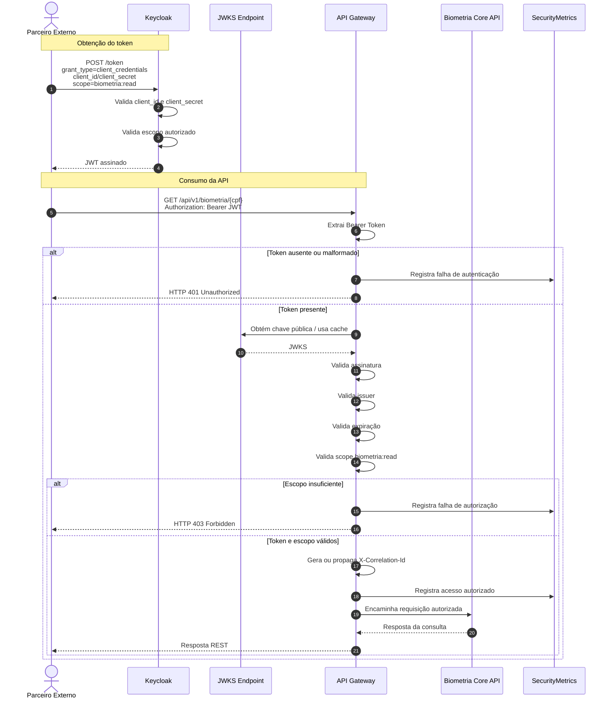

# Sequence Diagram — Autenticação OAuth2 Client Credentials

> **Projeto:** POC Vivo – Integração Arquitetural  
> **Artefato:** Diagrama de Sequência  
> **Fluxo:** Autenticação e autorização com OAuth2/JWT  
> **Versão:** 1.0  
> **Status:** Draft

---

# 1. Objetivo

Este artefato descreve o fluxo de autenticação e autorização utilizado por parceiros externos para consumir a API de biometria facial.

O objetivo é demonstrar como a solução aplica:

- OAuth2;
- JWT;
- Client Credentials Flow;
- validação de escopo;
- API Gateway como ponto único de entrada;
- Keycloak como Identity Provider;
- rastreabilidade por `correlationId`.

Este fluxo complementa principalmente:

- ADR-002 — API Gateway como ponto único de entrada;
- ADR-004 — OAuth2, JWT e Keycloak;
- ADR-005 — Observabilidade;
- ADR-006 — Versionamento de APIs.

---

# 2. Cenário

Um parceiro externo precisa consumir a API:

```http
GET /api/v1/biometria/{cpf}
```

Antes de chamar a API, o parceiro solicita um token OAuth2 ao Keycloak usando o fluxo **Client Credentials**.

Esse fluxo é adequado para comunicação sistema-sistema, pois não depende de interação de usuário final.

---

# 3. Pré-condições

- Existe um realm Keycloak para a POC.
- Existe um client para o parceiro externo.
- O client está autorizado a usar `client_credentials`.
- O client possui o escopo `biometria:read`.
- O API Gateway está configurado como OAuth2 Resource Server.
- O API Gateway valida tokens emitidos pelo Keycloak.
- O endpoint `/api/v1/biometria/{cpf}` exige autenticação.

---

# 4. Participantes

| Participante | Responsabilidade |
|---|---|
| Parceiro Externo | Solicita token e consome a API |
| Keycloak | Emite JWT |
| API Gateway | Valida JWT, issuer, expiração e escopo |
| JWKS Endpoint | Disponibiliza chave pública para validação da assinatura |
| Biometria Core API | Recebe apenas chamadas autorizadas |
| Logs estruturados | Registram decisões de segurança |
| Metrics | Registra sucesso/falha de autenticação/autorização |

---

# 5. Fluxo Narrativo — Sucesso

1. O parceiro externo envia `client_id`, `client_secret`, `grant_type=client_credentials` e escopo solicitado ao Keycloak.
2. O Keycloak valida as credenciais do client.
3. O Keycloak verifica se o client pode solicitar o escopo `biometria:read`.
4. O Keycloak emite um JWT assinado.
5. O parceiro chama o API Gateway enviando o token no header `Authorization`.
6. O API Gateway valida o token.
7. O API Gateway consulta ou utiliza cache do JWKS para validar a assinatura.
8. O API Gateway valida issuer, expiração e escopo.
9. O API Gateway gera ou propaga `X-Correlation-Id`.
10. O API Gateway encaminha a requisição para a Biometria Core API.
11. A Biometria Core API processa a requisição.

---

# 6. Fluxo Narrativo — Falha

A chamada deve ser bloqueada pelo gateway quando ocorrer:

- token ausente;
- token inválido;
- token expirado;
- issuer inválido;
- assinatura inválida;
- escopo insuficiente.

Respostas esperadas:

| Cenário | HTTP |
|---|---:|
| Token ausente | 401 |
| Token inválido | 401 |
| Token expirado | 401 |
| Escopo insuficiente | 403 |
| Client sem permissão | 403 |

---

# 7. Mermaid



---

# 8. Exemplo de Solicitação de Token

```bash
curl -X POST http://localhost:8081/realms/vivo-poc/protocol/openid-connect/token \
  -H "Content-Type: application/x-www-form-urlencoded" \
  -d "grant_type=client_credentials" \
  -d "client_id=partner-biometria-client" \
  -d "client_secret=<secret>" \
  -d "scope=biometria:read"
```

---

# 9. Exemplo de Chamada Autenticada

```bash
curl -X GET http://localhost:8080/api/v1/biometria/12345678909 \
  -H "Authorization: Bearer <token>" \
  -H "X-Correlation-Id: demo-001"
```

---

# 10. Claims Esperadas no Token

Exemplo conceitual:

```json
{
  "iss": "http://localhost:8081/realms/vivo-poc",
  "sub": "service-account-partner-biometria-client",
  "azp": "partner-biometria-client",
  "client_id": "partner-biometria-client",
  "scope": "biometria:read",
  "aud": "biometria-api",
  "iat": 1782820000,
  "exp": 1782823600
}
```

---

# 11. Logs Esperados

## Token válido

```text
gateway_token_validated
gateway_scope_authorized
gateway_route_forwarded
```

## Token ausente ou inválido

```text
gateway_token_missing
gateway_token_invalid
```

## Escopo insuficiente

```text
gateway_scope_denied
```

Campos mínimos:

```text
service
event
correlationId
clientId
scope
path
httpStatus
durationMs
```

---

# 12. Dados que Não Devem ser Logados

É proibido registrar:

- JWT completo;
- client secret;
- Authorization header completo;
- CPF completo;
- imagem/Base64;
- payload SOAP.

---

# 13. Métricas Esperadas

Métricas sugeridas:

```text
gateway.auth.success.total
gateway.auth.failure.total
gateway.authorization.failure.total
gateway.requests.total
gateway.requests.duration
```

---

# 14. Regras Arquiteturais Validadas

Este fluxo valida que:

- o parceiro não acessa o core diretamente;
- toda chamada passa pelo gateway;
- OAuth2/JWT é aplicado na borda;
- Keycloak é responsável pela emissão do token;
- escopo `biometria:read` controla acesso;
- chamadas sem autorização não chegam ao core;
- logs e métricas registram decisões de segurança;
- correlation ID é gerado ou propagado.

---

# 15. Checklist de Aderência

## Segurança

- [x] OAuth2 Client Credentials documentado.
- [x] JWT documentado.
- [x] Keycloak documentado.
- [x] Escopo `biometria:read` documentado.
- [x] 401 para falha de autenticação.
- [x] 403 para falha de autorização.
- [x] Core protegido atrás do Gateway.

## Observabilidade

- [x] Logs de sucesso.
- [x] Logs de falha.
- [x] Métricas de autenticação/autorização.
- [x] Correlation ID considerado.

## Versionamento

- [x] Endpoint `/api/v1/biometria/{cpf}` mantido.

## Implementação futura

- [ ] Configurar Keycloak.
- [ ] Criar realm `vivo-poc`.
- [ ] Criar client `partner-biometria-client`.
- [ ] Criar escopo `biometria:read`.
- [ ] Configurar Gateway como Resource Server.
- [ ] Testar chamada sem token.
- [ ] Testar chamada com token inválido.
- [ ] Testar chamada com token válido.
- [ ] Testar escopo insuficiente.
- [ ] Validar logs e métricas.

---

# 16. Local Sugerido

```text
docs/diagrams/sequence/autenticacao-oauth2-client-credentials.md
```

---

# 17. Próximo Artefato

```text
docs/diagrams/sequence/autenticacao-oauth2-client-credentials.mmd
```
