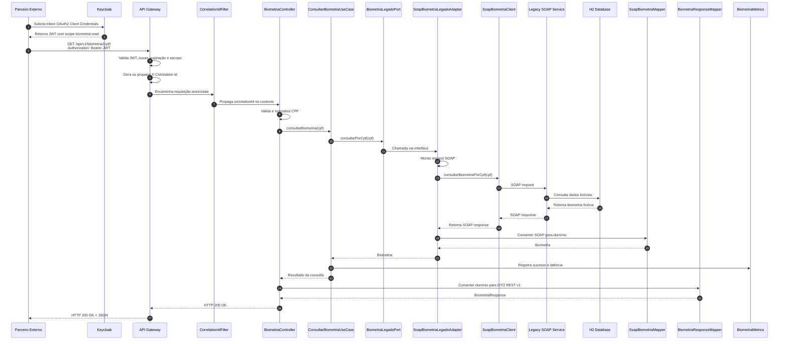

# Sequence Diagram — Consulta de Biometria — Fluxo Feliz

> **Projeto:** POC Vivo – Integração Arquitetural  
> **Artefato:** Diagrama de Sequência  
> **Fluxo:** Consulta de biometria com sucesso  
> **Versão:** 1.0  
> **Status:** Draft

---

# 1. Objetivo

Este artefato descreve o fluxo de sequência da consulta de biometria facial por CPF quando todos os componentes respondem com sucesso.

O objetivo é demonstrar como a requisição percorre a arquitetura definida nos artefatos anteriores:

```text
Parceiro Externo
→ API Gateway
→ Biometria Core API
→ SOAP Adapter
→ Legacy SOAP Service
→ H2 Database
```

Este diagrama complementa:

- C1 — System Context;
- C2 — Container Diagram;
- C3 — Component Diagram;
- ADR-001 — Exposição do legado SOAP via REST;
- ADR-002 — API Gateway;
- ADR-003 — Adapter e Anti-Corruption Layer;
- ADR-004 — OAuth2/JWT;
- ADR-005 — Observabilidade;
- ADR-006 — Versionamento.

---

# 2. Cenário

Um parceiro externo autorizado consulta a biometria facial fictícia de um cliente informando o CPF.

Endpoint público:

```http
GET /api/v1/biometria/{cpf}
```

Pré-condições:

- O parceiro possui `client_id` e `client_secret`.
- O parceiro obteve token JWT válido no Keycloak.
- O token contém o escopo `biometria:read`.
- O API Gateway está disponível.
- A Biometria Core API está disponível.
- O Legacy SOAP Service está disponível.
- O H2 possui massa fictícia para o CPF consultado.

---

# 3. Participantes

| Participante | Responsabilidade |
|---|---|
| Parceiro Externo | Consumidor autorizado da API |
| Keycloak | Emite token JWT |
| API Gateway | Valida JWT, aplica política e roteia |
| CorrelationIdFilter | Garante rastreabilidade |
| BiometriaController | Recebe requisição REST |
| ConsultarBiometriaUseCase | Orquestra caso de uso |
| BiometriaLegadoPort | Define contrato de saída |
| SoapBiometriaLegadoAdapter | Implementa integração SOAP |
| SoapBiometriaClient | Executa chamada SOAP |
| Legacy SOAP Service | Simula serviço legado |
| H2 Database | Simula Oracle legado |
| SoapBiometriaMapper | Converte resposta SOAP |
| BiometriaResponseMapper | Converte domínio para REST |
| GlobalExceptionHandler | Não atua no fluxo feliz |
| BiometriaMetrics | Registra métricas |
| Logs estruturados | Registram eventos técnicos |

---

# 4. Fluxo Narrativo

1. O parceiro solicita um token OAuth2 ao Keycloak.
2. O Keycloak retorna um JWT válido com escopo `biometria:read`.
3. O parceiro chama o endpoint REST versionado no API Gateway.
4. O API Gateway valida assinatura, issuer, expiração e escopo do JWT.
5. O API Gateway gera ou propaga o header `X-Correlation-Id`.
6. O API Gateway encaminha a requisição para a Biometria Core API.
7. O CorrelationIdFilter registra o correlation ID no contexto de logs.
8. O BiometriaController recebe o CPF.
9. O CPF é validado e normalizado.
10. O controller chama o ConsultarBiometriaUseCase.
11. O use case aciona a BiometriaLegadoPort.
12. O SoapBiometriaLegadoAdapter implementa a porta.
13. O adapter monta a chamada SOAP.
14. O SoapBiometriaClient envia a requisição ao Legacy SOAP Service.
15. O Legacy SOAP Service consulta o H2 Database.
16. O H2 retorna dados fictícios.
17. O Legacy SOAP Service retorna resposta SOAP.
18. O SoapBiometriaMapper converte a resposta SOAP para modelo interno.
19. O use case retorna o resultado ao controller.
20. O BiometriaResponseMapper converte o modelo interno para DTO REST v1.
21. O controller retorna HTTP 200.
22. O gateway devolve a resposta ao parceiro.
23. Logs e métricas registram o sucesso e a latência.

---

# 5. Mermaid



---

# 6. Resposta REST Esperada

Exemplo conceitual:

```json
{
  "cpf": "***.***.***-09",
  "biometriaDisponivel": true,
  "imagemBase64": "valor-ficticio-base64",
  "origem": "LEGADO_SOAP",
  "dataConsulta": "2026-06-30T12:00:00Z",
  "correlationId": "demo-001"
}
```

Observação:

O campo `imagemBase64` existe apenas para fins de POC com dado fictício. Em uma solução produtiva, recomenda-se avaliar alternativas mais seguras, como URL temporária, tokenização ou mecanismo controlado de download.

---

# 7. Logs Esperados

## API Gateway

Eventos esperados:

```text
gateway_request_received
gateway_token_validated
gateway_route_forwarded
gateway_response_returned
```

Campos mínimos:

```text
service
event
correlationId
clientId
path
httpStatus
durationMs
```

---

## Biometria Core API

Eventos esperados:

```text
biometria_request_received
biometria_cpf_validated
biometria_use_case_started
biometria_soap_call_started
biometria_soap_call_finished
biometria_response_returned
```

---

## Legacy SOAP Service

Eventos esperados:

```text
legacy_soap_request_received
legacy_soap_database_query_started
legacy_soap_database_query_finished
legacy_soap_response_returned
```

---

# 8. Métricas Esperadas

Métricas mínimas sugeridas:

```text
biometria.requests.total
biometria.success.total
biometria.requests.duration
biometria.soap.duration
legacy.soap.requests.total
gateway.requests.total
```

---

# 9. Regras de Segurança no Fluxo

Durante o fluxo feliz:

- O JWT completo não deve ser logado.
- O CPF completo não deve ser logado.
- A imagem/Base64 não deve ser logada.
- O SOAP envelope completo não deve ser logado.
- O correlation ID deve ser propagado.
- O escopo `biometria:read` deve ser validado.

---

# 10. Regras Arquiteturais Validadas pelo Fluxo

Este fluxo confirma as seguintes decisões:

- O parceiro não acessa o core diretamente.
- O parceiro não acessa o legado diretamente.
- O gateway atua como ponto único de entrada.
- O core atua como fachada REST.
- O use case depende de uma porta.
- O adapter implementa a integração SOAP.
- O legado SOAP fica isolado.
- A resposta REST não expõe o contrato SOAP.
- Logs e métricas são transversais.
- O endpoint é versionado em `/api/v1`.

---

# 11. Checklist de Aderência

## Arquitetura

- [x] Fluxo respeita C1.
- [x] Fluxo respeita C2.
- [x] Fluxo respeita C3.
- [x] Parceiro acessa apenas o Gateway.
- [x] Gateway encaminha para o Core.
- [x] Core chama SOAP via Adapter.
- [x] Legado SOAP consulta H2.
- [x] SOAP não vaza para REST.

## Segurança

- [x] Token OAuth2/JWT considerado.
- [x] Escopo `biometria:read` considerado.
- [x] Gateway valida autenticação.
- [x] Dados sensíveis não devem ser logados.

## Observabilidade

- [x] Correlation ID considerado.
- [x] Logs estruturados considerados.
- [x] Métricas consideradas.
- [x] Latência SOAP considerada.

## Versionamento

- [x] Endpoint versionado `/api/v1`.
- [x] DTO REST v1 considerado.

## Implementação futura

- [ ] Implementar fluxo no Gateway.
- [ ] Implementar fluxo no Core.
- [ ] Implementar fluxo no SOAP fake.
- [ ] Criar testes de integração.
- [ ] Validar logs por correlation ID.
- [ ] Validar métricas expostas.

---

# 12. Local Sugerido

```text
docs/
└── diagrams/
    └── sequence/
        └── consultar-biometria-fluxo-feliz.md
```

---

# 13. Próximo Artefato

Próximo artefato recomendado:

```text
docs/diagrams/sequence/consultar-biometria-fluxo-feliz.mmd
```

Esse arquivo conterá apenas o Mermaid puro, facilitando renderização direta no GitHub ou em ferramentas de documentação.
