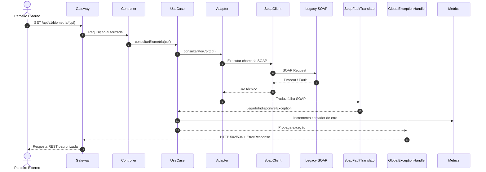

# Sequence Diagram — Indisponibilidade do Legado SOAP

> **Projeto:** POC Vivo – Integração Arquitetural  
> **Artefato:** Diagrama de Sequência  
> **Fluxo:** Falha do serviço SOAP legado  
> **Versão:** 1.0

---

# 1. Objetivo

Descrever o comportamento esperado da arquitetura quando o serviço legado SOAP estiver indisponível, reforçando as estratégias de resiliência, tratamento de exceções e observabilidade.

Este fluxo valida principalmente as decisões registradas nas ADRs de:

- Resiliência
- Observabilidade
- OAuth2/JWT
- Adapter / Anti-Corruption Layer

---

# 2. Cenário

O parceiro realiza uma consulta válida, porém o serviço SOAP não responde dentro do tempo esperado (timeout) ou encontra-se indisponível.

Pré-condições:

- JWT válido.
- Escopo `biometria:read`.
- Gateway e Core disponíveis.
- Serviço SOAP indisponível.

---

# 3. Resultado Esperado

A aplicação deve:

- Não expor detalhes internos do SOAP.
- Traduzir a falha para exceção de domínio.
- Registrar logs estruturados.
- Registrar métricas.
- Preservar o Correlation ID.
- Retornar erro REST padronizado.

HTTP recomendado:

```http
502 Bad Gateway
```

ou

```http
504 Gateway Timeout
```

dependendo da natureza da falha.

---

# 4. Mermaid



---

# 5. Error Response Esperado

```json
{
  "timestamp": "2026-06-30T12:00:00Z",
  "status": 502,
  "error": "LEGADO_INDISPONIVEL",
  "message": "Não foi possível consultar a biometria neste momento.",
  "correlationId": "demo-001"
}
```

Nenhuma informação sobre:

- SOAP Fault
- Oracle
- Stack trace
- XML
- Infraestrutura

deve ser retornada ao consumidor.

---

# 6. Logs Esperados

Gateway:

```text
gateway_request_received
gateway_response_returned
```

Core:

```text
biometria_request_received
biometria_soap_call_started
biometria_soap_call_failed
```

SOAP:

```text
legacy_soap_request_received
legacy_soap_fault_returned
```

Todos contendo o mesmo `correlationId`.

---

# 7. Resiliência

Nesta POC:

- Timeout configurado.
- Tradução de falhas.
- Resposta REST padronizada.

Como evolução:

- Retry controlado.
- Circuit Breaker.
- Bulkhead.
- Fallback.
- Alertas automáticos.

---

# 8. Checklist

## Arquitetura

- [x] Gateway permanece disponível.
- [x] Core isola o legado.
- [x] SOAP não vaza para REST.
- [x] Exceção traduzida para domínio.

## Segurança

- [x] Nenhum detalhe interno exposto.

## Observabilidade

- [x] Correlation ID preservado.
- [x] Logs estruturados.
- [x] Métricas de erro.

## Resiliência

- [x] Timeout previsto.
- [x] HTTP 502/504 documentado.
- [ ] Circuit Breaker (evolução).
- [ ] Retry controlado (evolução).

---

# 9. Local Sugerido

```text
docs/diagrams/sequence/legado-soap-indisponivel.md
```

---

# 10. Próximo Artefato

```text
docs/diagrams/sequence/legado-soap-indisponivel.mmd
```
